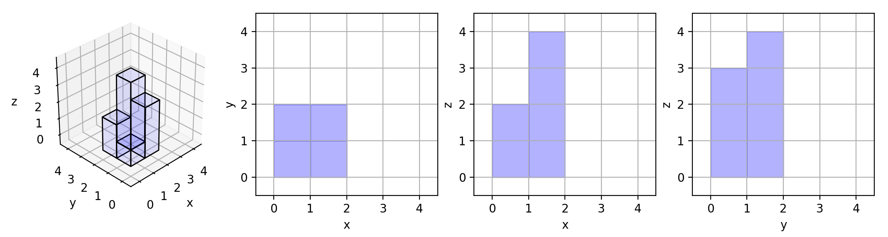

# D17 883. Projection Area of 3D Shapes

## 题目链接

[883. Projection Area of 3D Shapes](https://leetcode.com/problems/projection-area-of-3d-shapes/)

## 题目分析

这个题目要求计算一个三维柱状图的“表面积”。

当输入为`[[1,2],[3,4]]`时如图所示。

底面为2+2=4，这个应该不用多说；  
从x面看过去，左边前面的柱子高度为1，后面的柱子高度为2，故这一行取高度为2，右边柱子同理取4，因此2+4=6；  
从y面后面看向x减少的方向时（从例图的右上看向左下时），前面的柱子挡住了后面的柱子，因此为3+4=7；  
最后得4+6+7=17。



## 思路

从题目解析可以得知，每一面每一行（或每一列）取最大值相加即可。

传进来的是一个二维数组。  
X固定时：二维数组的第1个元素代表`x=1`时，`z`的值（y轴的间隔为1）；第2个元素代表`x=2`时，`z`的值。  
那么我们先遍历`x=1`时的情况。显然用`max`函数取`$grid[$i]`的最大值`2`即可得z轴上的最大值。  
当值为0时，没有柱子，也就不会在底面形成投影。故计算`$grid[$i]`中的非零元素个数既得在该列在底面上的投影。

已经解决了底面z面（从左上往右下看），那么剩下y轴（从左下往右上看）了。  
计算二维数组每一个元素中，相同位置的值的最高值即可。（这个好像比较难描述）  
取`A[i][0]`的最大值遍历下去即可。

## 最终代码

```php
<?php
class Solution {
    function projectionArea($grid) {
        $total = 0;
        foreach($grid[0] as $k => $c){
            $total += max(array_column($grid,$k));
        }
        foreach($grid as $key => $coord){
            $total += max($coord);
            $total += count(array_filter($coord));
        }
        return $total;
    }
}
```

若觉得本文章对你有用，欢迎用[爱发电](https://afdian.net/@skys215)资助。

